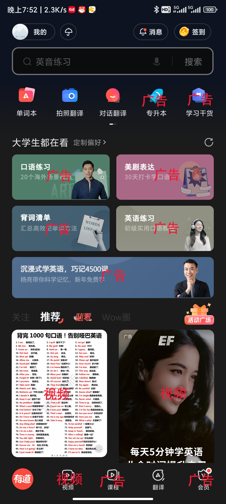
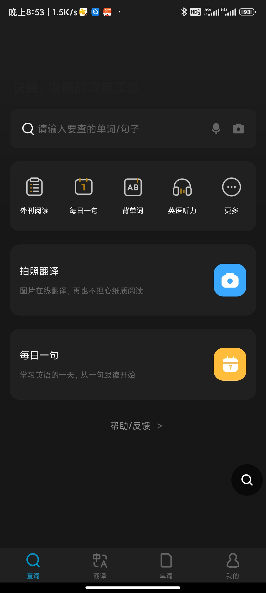
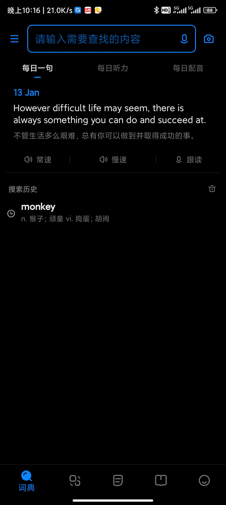

# 词典软件

## 有道词典

还能有比这个广告更多的词典软件吗？
有道词典在小米应用商店中有 4.3亿 下载， 词典软件下载量小米应用商店里排第一。但是这个软件真的名符其实吗？真的有那么好用吗？今天我就来吐槽一下有道词典这个app。

网易在我的印象里，还是不错的，相对百度腾讯啥的，负面新闻相对较少。
我曾经也是有道词典的忠实用户，特别是他的单词本功能，用来学习英语很有帮助。
但是这个词典越做越臃肿，越做广告越多。

我对词典软件的需求，只需要以下几个功能：

1. 查词，可以播放读音，还能加入生词本。
2. 整段翻译。

基本就够用了，软件的体积越小越好，界面越简洁越好。
然而，就一个查单词的软件， 现在做的全是广告

刚打开app的界面，就是一个开屏广告

开屏广告应该是所有广告类型中，用户体验最差的，整个手机铺满了广告，而且必须点击关闭，才能关闭。一不小心点错了，那么恭喜你，为app挣得了几毛钱的广告费(如果是按照点击率付费的广告)。

好的，我现在手工点击关闭之后进入主界面

其中大部分都是广告连接。

作为一个公司的产品，要赚钱，没问题。
但是牺牲产品的用户体验，我觉得是有问题的。
整个首页70%在显示广告，丁三石现在都缺钱缺成这样了吗？

作为一个词典软件，甚至还内置了一个短视频功能。
呃，还行吧，毕竟连拼多多这种购物app都内置了短视频功能。
虽然我刷短视频，还是会用抖音。

下面介绍两个替代品:
都是只有查词，翻译，单词本功能，没有广告，没有花里胡哨。

## 金山词霸

小米应用商店2.7亿下载
软件大小: 27m

## 欧陆词典

小米用用闪电3572万下载
软件大小: 78m

我本人现在在用 欧路词典。
