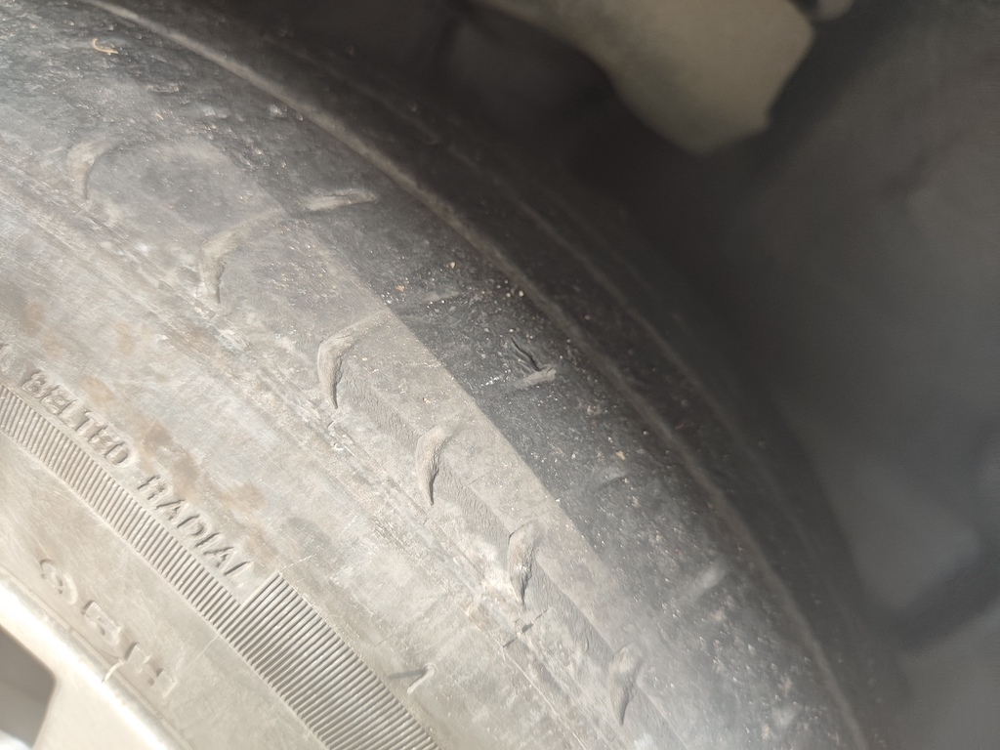
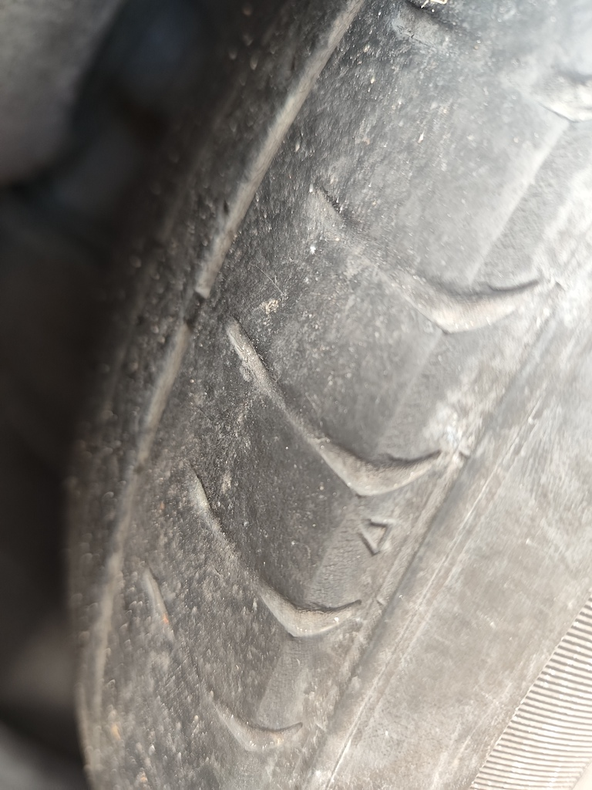
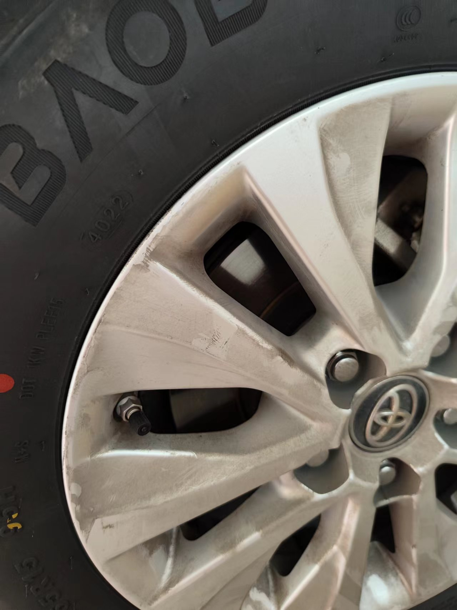
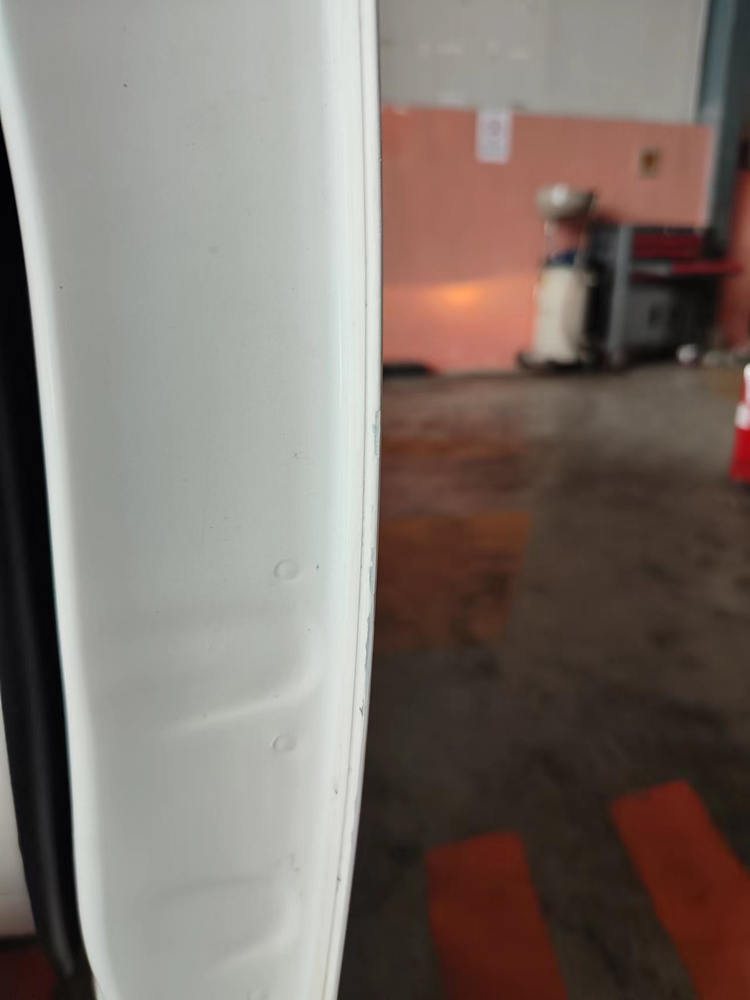
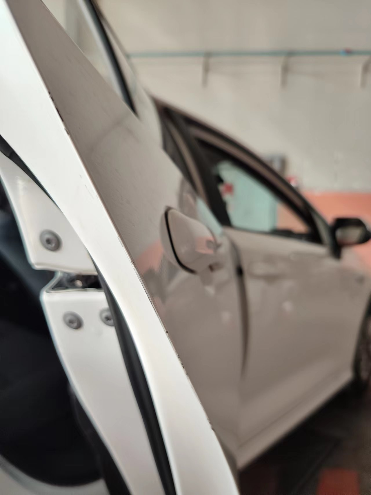
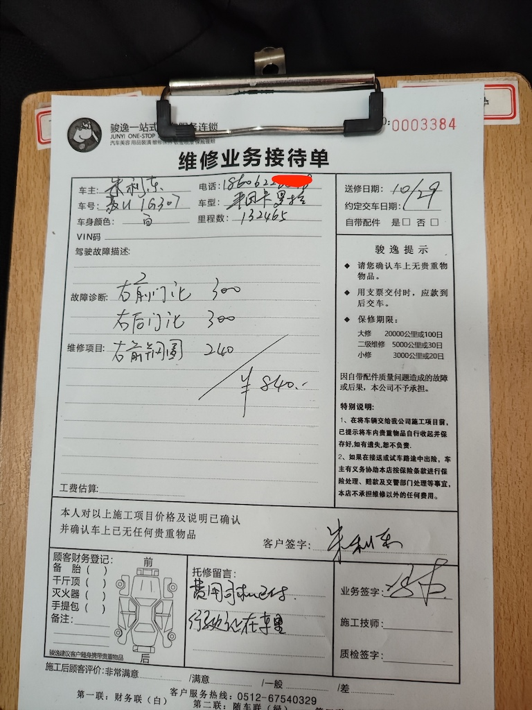

# T3租车争议

## 事件简述

投诉对象:
1.南京润丰领行汽车科技有限公司苏州分公司(统一社会信用代码:91320594MA231BQ8XP)
2.上述公司的的全资子公司上海嘉行汽车服务有限公司(统一社会信用代码:91310000691647478G)

事情很简单，也很小，就是75的费用争议，数量不多，但是不合理的收费，即使是1元，也不行。

司机于2022年9月22日起租上海嘉行汽车服务有限公司的车子，丰田卡罗拉混动版
租金是3800每月，租用三个月。缴纳保证金10000元，如果违约，违约金为20%x租金。

## 司机去4s店保养

按照合同规定，车子的保养是车行支付的，无需司机支付，但是保养需要司机开往指定4s店。

司机于2022年10月28日去指定的4s店(苏州裕达丰田汽车销售服务有限公司(相城区店))保养
期间提示店员右前轮胎没有纹路了,雨天会打滑，有严重安全问题。但是并未提出强制更换要求。
接待员明确表示会查看检查,如果符合规定，可以更换。
后来4s店更换了轮胎，期间并未有任何异议，司机认为此次更换轮胎，是符合规定的。

轮胎磨损情况， 都没纹路了，有极大安全隐患。

隔天4s店打电话给司机说， 车行认为轮胎没到公里数就换了，有75的差价，这差价需要司机补偿。
司机表示很无辜，因为在更换的时候并未提示公里数未到，也并未提示有75的差价。
司机在电话里明确拒绝补偿他们所谓的75差价，随后对方挂断电话。
此次事件的争议点是: 这个费用是4s店跟车行之间的矛盾，车行认为4s店轮胎没有到公里数就换了，需要4s店赔偿75。不过最终莫名把这费用转嫁给司机身上，实在不可理解，也许保证金在他们手上，可以有恃无恐的扣除吧。司机只负责去4s店保养，具体操作都是4s店在操作，凭什么要司机承担者75，没有任何道理。
退一万步讲，即使非要强制扣在司机身上，可是司机并没有在此次事件中获得任何利益，凭什么要支付这75。
但凡4s店跟司机说公里数没到不予更换，也没有此次争议点。司机根本就不知道公里数，全凭对方一张嘴，对司机很不公平。

## 司机退车

司机于2022年10月29日(保养后的第二天)退车，退车的时候已经缴纳了车损840，尽管退车主管挑刺式的找毛病，司机为了不惹麻烦，都认了。

以下是车损的照片跟维修费用:

这个是说轮毂有刮痕，维修费用240，尽管司机没看出哪儿个地方有损伤

这个是右前门的边缘，说是有掉漆 维修 300

这个是右后门的边缘，说是有掉漆 维修 300

租车取车的时候，让司机检查，未检查到的损伤都算司机的。
司机并未检查此位置，并不排除车子本来就是这样的。
而且这损伤，恐怕有点吹毛求疵。

司机心里虽然十分不赞同，但是为了不惹麻烦，最终司机已于当场，缴纳维修费用。

## 75的争议

退10000押金的时候，退车单子上有这75的车损，司机跟对方提出异议，对方并未理会。
在司机不知情的时候，强行让这他们所谓的75差价，让司机负责，这很不合理。
司机为了顺利退保证金，搁置争议。
现在保证金退了，司机想为这75的费用，提出争议仲裁。

为什么作为消费者，在其他消费领域都是说消费者是上帝，但是在租赁领域，都是弱势者？保证金可以被出租方随意扣除，无论租用者是否同意。建议有关部门严查此类企业，保护消费者的合法权益，保证金不被随便扣除。

最后，司机请求评评理，这75该认了吗？
